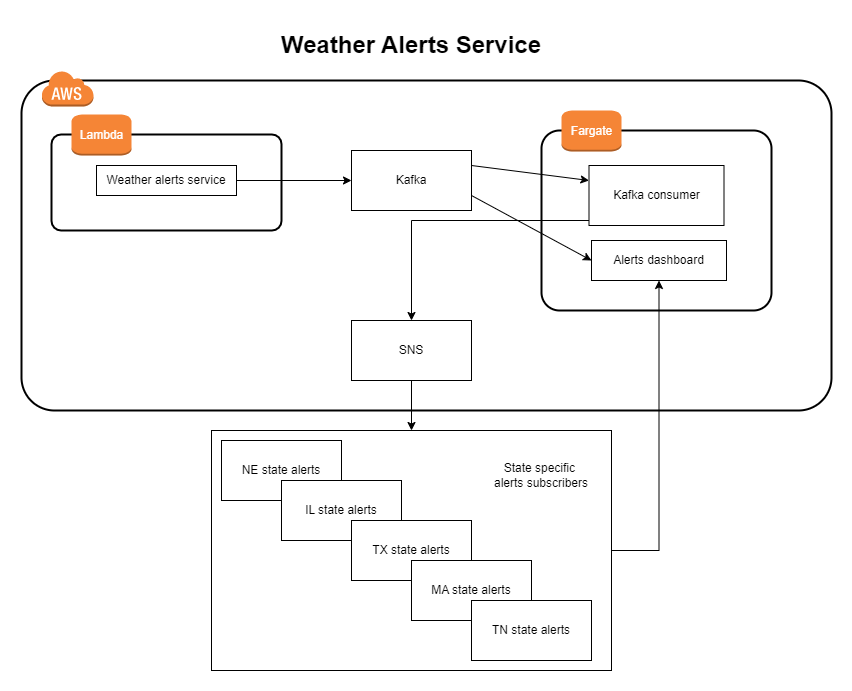

# Weather alerts service

Farting around with Kafka, CDK, SNS, etc

# Running locally

1. make sure aws cli env variables are set
2. `docker-compose up`
3. `yarn dev`
4. cd into src/alerts_dashboard and `yarn dev`

# Running on AWs

not implemented yet
